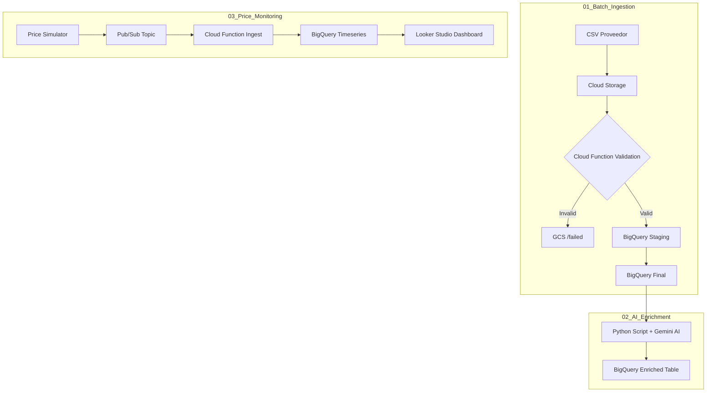

# Ecommerce Data Intelligence Solution

```mermaid
graph TD
    subgraph "01_Batch_Ingestion"
        A[CSV Proveedor] --> B[Cloud Storage]
        B --> C{Cloud Function Validation}
        C -- Invalid --> D[GCS /failed]
        C -- Valid --> E[BigQuery Staging]
        E --> F[BigQuery Final]
    end

    subgraph "02_AI_Enrichment"
        F --> G[Python Script + Gemini AI]
        G --> H[BigQuery Enriched Table]
    end

    subgraph "03_Price_Monitoring"
        I[Price Simulator] --> J[Pub/Sub Topic]
        J --> K[Cloud Function Ingest]
        K --> L[BigQuery Timeseries]
        L --> M[Looker Studio Dashboard]
    end   
```