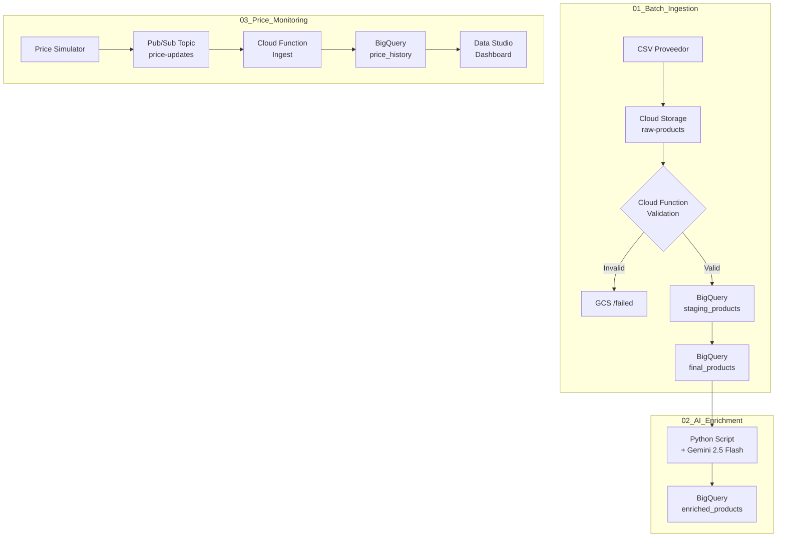
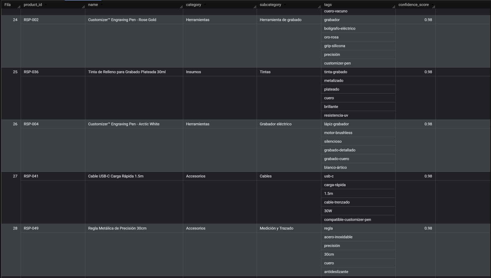
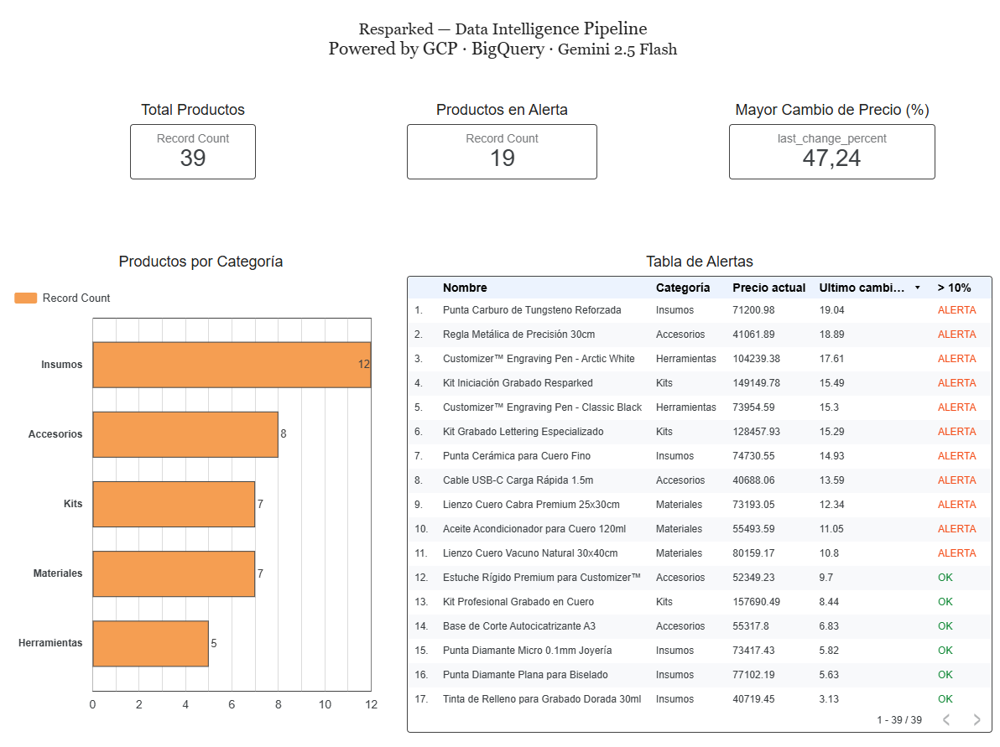

# GCP E-Commerce Data Intelligence Pipeline

> End-to-end data engineering project built on Google Cloud Platform 
> for a dropshipping operation — automating product ingestion, 
> AI-powered categorization, and real-time price monitoring.

---

## Business Problem

Dropshipping operations deal with three recurring data challenges: 
**unreliable supplier files** that break downstream processes, 
**thousands of uncategorized products** that require manual tagging, 
and **price fluctuations** that need to be caught before they erode 
margins. This pipeline automates all three.

---

## Architecture



---

## Tech Stack

| Layer | Technology |
|-------|-----------|
| Storage | Google Cloud Storage (GCS) |
| Data Warehouse | BigQuery |
| Compute | Cloud Functions Gen2 |
| Messaging | Pub/Sub |
| AI / LLM | Gemini 2.5 Flash via Vertex AI (`google-genai`) |
| Orchestration | Eventarc (GCS + Pub/Sub triggers) |
| Visualization | Data Studio (formerly Looker Studio) |
| Language | Python 3.12 |
| IaC | gcloud CLI (`infra/setup.sh`) |

---

## Project Structure

```
gcp-ecommerce-data-intelligence/
├── infra/
│   └── setup.sh                    # Infrastructure provisioning (idempotent)
├── 01_batch_ingestion/
│   ├── main.py                     # Cloud Function — CSV validation & BQ load
│   └── requirements.txt
├── 02_ai_enrichment/
│   ├── enrich.py                   # Gemini 2.5 Flash enrichment script
│   └── requirements.txt
├── 03_price_monitoring/
│   ├── simulator.py                # Pub/Sub price event simulator
│   ├── main.py                     # Cloud Function — Pub/Sub consumer
│   └── requirements.txt
├── 04_dashboard/
│   └── v_dashboard_products.sql    # Unified BigQuery view for Data Studio
├── data/
│   └── products_load.csv           # Sample supplier data (Resparked brand)
├── docs/
│   ├── enriched_products_preview.png
│   └── data_studio_dashboard.png
├── tests/
│   ├── test_enrichment.py            # Unit tests for AI enrichment
│   ├── test_ingestion.py             # Unit tests for validation logic
│   └── test_price_monitoring.py      # Unit tests for price monitoring
└── README.md
``` 

---

## Module 01 — Batch Ingestion

Triggers automatically when a `.csv` file lands in the `raw-products` 
bucket via an Eventarc trigger on `google.cloud.storage.object.v1.finalized`.

**Validation logic (row-level):**
- `product_id` cannot be null or empty
- `price` must be numeric and greater than 0
- `supplier` cannot be empty or `"Unknown"`

Valid rows load to `staging_products` with an `ingested_at` timestamp. 
Invalid rows are logged individually with rejection reasons to Cloud 
Logging. Unparseable files (wrong encoding, missing columns) are moved 
to the `failed-products` bucket.

**Test results against sample data (50 rows):**
- ✅ 40 rows loaded to `final_products`
- ❌ 10 rows rejected: 7 invalid price, 3 missing product_id, 
  2 unknown supplier

**Observability:** every rejected row generates a structured log entry 
with the specific validation failure, enabling a Data Quality Dashboard 
in the future.

**Idempotency:** the promotion script from staging to final uses a 
`MERGE` statement, ensuring re-running the pipeline doesn't create 
duplicate records.

```bash
# Trigger manually by uploading a file
gsutil cp data/products_load.csv gs://${PROJECT_ID}-raw-products/
```

---

## Module 02 — AI Enrichment

Reads product `name` and `description` from `final_products`, sends 
them to Gemini 2.5 Flash via Vertex AI, and writes structured 
enrichment data to `enriched_products`.

**Processing architecture:**
- Synchronous loop with `time.sleep(4)` between requests to respect 
  Vertex AI rate limits — conservative by design to guarantee 100% 
  success rate across the catalog
- Pydantic schema validation on every Gemini response before writing 
  to BigQuery — malformed responses fail fast instead of corrupting 
  the table
- Incremental by design: `LEFT JOIN` against `enriched_products` 
  ensures already-processed products are never sent to Gemini again
- Batch insert: results accumulate in a buffer and flush to BigQuery 
  every 10 products, not one-by-one

**Results on Resparked dataset (39 products):**
- ✅ 39/39 products enriched successfully
- ⏱ ~200 seconds total processing time
- 📊 Average confidence score: 0.97
- Categories identified: Herramientas, Insumos, Accesorios, 
  Materiales, Kits

**Enriched schema written to BigQuery:**
```json
{
  "product_id": "RSP-002",
  "category": "Herramientas",
  "subcategory": "Herramienta de grabado",
  "tags": ["grabador", "bolígrafo-eléctrico", "oro-rosa",
           "grip-silicona", "precisión", "customizer-pen"],
  "confidence_score": 0.98,
  "enriched_at": "2026-04-24T00:30:00Z"
}
```



```bash
# Run enrichment (incremental — skips already-processed products)
export GCP_PROJECT=your-project-id
export DATASET_NAME=dropshipping
python 02_ai_enrichment/enrich.py
```

---

## Module 03 — Real-Time Price Monitoring

This module shifts the pipeline from batch processing to a live 
streaming architecture, enabling the business to react to supplier 
price fluctuations as they happen.

**Workflow:**

1. **Event Simulator** (`simulator.py`) — a Python service that mimics 
   a supplier pricing API. It reads active SKUs from `final_products` 
   and broadcasts randomized price change events every 5 seconds via 
   Pub/Sub. Designed to stress-test the consumer function under 
   sustained load and validate system resilience before connecting 
   a real supplier feed.

2. **Pub/Sub Messaging** — acts as the decoupled ingestion layer, 
   handling asynchronous price update events. If the downstream 
   consumer fails, Pub/Sub retains messages and retries automatically 
   — zero data loss by design.

3. **Stream Consumer** (`main.py`) — a Cloud Function Gen2 that 
   triggers on every Pub/Sub message, decodes the payload, calculates 
   `change_percent`, and persists the event to `price_history` as a 
   time-series record.

**Key engineering decisions:**

- **Threshold alerts** — the simulator logs a `WARNING` for any price 
  change exceeding ±10%, simulating a real-world business alert. 
  Natural next step: route those warnings to a Slack webhook or 
  Cloud Monitoring alert policy.
- **Discard vs retry** — invalid or malformed Pub/Sub messages are 
  logged and discarded (no exception re-raise), while BigQuery write 
  failures re-raise to trigger Cloud Functions' built-in retry. 
  This prevents poison-pill messages from blocking the queue.
- **Decoupled producer/consumer** — the simulator and the Cloud 
  Function share only the Pub/Sub topic contract. Either side can 
  be replaced independently without touching the other.

```bash
# Start the price simulator (runs indefinitely, Ctrl+C to stop)
export GCP_PROJECT=your-project-id
export DATASET_NAME=dropshipping
python 03_price_monitoring/simulator.py
```

---

## Module 04 — Business Intelligence Dashboard

A **Data Studio** report connected directly to the 
`v_dashboard_products` BigQuery view, providing a real-time 
operational view of the full pipeline output.

**The view (`04_dashboard/v_dashboard_products.sql`)** consolidates 
all three pipeline layers into a single queryable source:
- Product catalog and stock from `final_products`
- AI-generated categories and tags from `enriched_products`
- Latest price and volatility from `price_history` (via `ROW_NUMBER` 
  window function to guarantee one row per product)

**Dashboard components:**

| Component | Field | Business question answered |
|-----------|-------|---------------------------|
| Scorecard | `Record Count` | How many SKUs are active? |
| Scorecard | `Record Count` + filter `price_alert = ALERTA` | How many products need repricing? |
| Scorecard | `last_change_percent` MAX | What's the highest price volatility today? |
| Bar chart | `category` × `Record Count` | How is inventory distributed by AI category? |
| Alert table | `name`, `category`, `current_price`, `last_change_percent`, `price_alert` | Which products need immediate Shopify action? |

**Conditional formatting:** rows where `price_alert = ALERTA` are 
highlighted in red, giving the operations team an instant visual 
signal to adjust pricing before margins are impacted.



---

## Technical Challenges & Solutions

**Cloud credential management** — the project initially used the 
standalone Gemini API key. To maintain a unified security posture 
within the GCP ecosystem, the enrichment module was migrated to 
Vertex AI, enabling seamless authentication via Application Default 
Credentials (ADC) and Service Accounts — eliminating manual API key 
rotation entirely.

**Rate limiting with Vertex AI** — Gemini 2.5 Flash on Vertex AI 
enforces per-minute token quotas. The enrichment module implements 
a conservative synchronous loop with `time.sleep(4)` between 
requests and exponential backoff retry (up to 3 attempts per 
product), achieving a 100% success rate across the full catalog 
without a single dropped record.

**Real-time vs cost balance** — instead of provisioning Dataflow 
jobs for price monitoring, the pipeline uses Cloud Functions Gen2 
+ Pub/Sub. This provides a serverless, event-driven architecture 
that scales to zero when no price updates are being broadcast, 
keeping operational costs near zero during idle periods.

---

## Key Engineering Patterns

**Dead-letter pattern** — corrupt or unparseable files are isolated 
in a separate bucket instead of failing silently, enabling manual 
review without data loss.

**Staging-to-core loading** — data lands in `staging_products` first 
for inspection before promotion to `final_products`. This mirrors 
production ELT patterns used in enterprise data warehouses.

**Row-level validation with structured logging** — each row is 
evaluated independently and rejection reasons are logged with row 
index and motif, giving full observability into data quality over time.

**Structured LLM output** — Gemini responses are constrained to a 
JSON schema with Pydantic validation, making AI output safe to write 
directly to BigQuery without manual parsing.

**Incremental processing** — the enrichment script uses a `LEFT JOIN` 
to detect and skip already-processed products, making every run 
idempotent and safe to re-execute.

---

## Design Decisions

- **Gemini 2.5 Flash over Pro** — lower latency and cost for batch 
  categorization. Flash handles product description analysis with 
  equivalent accuracy at a fraction of the price.
- **Vertex AI over Gemini API** — unified authentication via ADC, 
  no API key management, and native integration with the existing 
  GCP project billing.
- **Cloud Functions Gen2 over Dataflow** — for this data volume, 
  a serverless function is faster to deploy, cheaper to run, and 
  easier to maintain than a full Dataflow pipeline.
- **Row-level vs file-level rejection** — rejecting entire files on 
  partial errors would discard valid data. Row-level validation 
  maximizes throughput while maintaining auditability.
- **gcloud CLI over Terraform** — for a single-environment portfolio 
  project, a documented Bash script is more transparent and auditable 
  than Terraform state management.
- **Data Studio over custom dashboard** — native BigQuery connector 
  with zero infrastructure cost. The `v_dashboard_products` view acts 
  as a semantic layer, keeping all join logic out of the 
  visualization tool.

---

## Setup

**Prerequisites:** GCP project with billing enabled, `gcloud` CLI 
authenticated.

```bash
# 1. Clone the repo
git clone https://github.com/Pulpoide/gcp-ecommerce-data-intelligence.git
cd gcp-ecommerce-data-intelligence

# 2. Set your project
export PROJECT_ID=your-project-id
export DATASET_NAME=dropshipping
export PROJECT_NUMBER=your-project-number

# 3. Provision all infrastructure (idempotent — safe to re-run)
bash infra/setup.sh

# 4. Deploy Module 01 — Batch Ingestion
gcloud functions deploy ingest-products \
  --gen2 --runtime=python312 --region=us-central1 \
  --source=./01_batch_ingestion --entry-point=process_csv \
  --trigger-event-filters="type=google.cloud.storage.object.v1.finalized" \
  --trigger-event-filters="bucket=${PROJECT_ID}-raw-products" \
  --set-env-vars GCP_PROJECT=${PROJECT_ID},DATASET_NAME=${DATASET_NAME} \
  --memory=256Mi --timeout=120s

# 5. Run Module 02 — AI Enrichment
python 02_ai_enrichment/enrich.py

# 6. Deploy Module 03 — Price Monitoring
gcloud functions deploy process_price_update \
  --gen2 --runtime=python312 --region=us-central1 \
  --source=./03_price_monitoring --entry-point=process_price_update \
  --trigger-topic=price-updates \
  --service-account=${PROJECT_NUMBER}-compute@developer.gserviceaccount.com \
  --set-env-vars GCP_PROJECT=${PROJECT_ID},DATASET_NAME=${DATASET_NAME} \
  --memory=256Mi --timeout=60s

# 7. Start the price simulator
python 03_price_monitoring/simulator.py
```

---

## Scalability & Future Proofing

Although this MVP processes a limited catalog, the architecture is 
natively elastic by design.

**Ingestion** — Pub/Sub handles millions of messages per second 
without additional configuration. Adding a new supplier feed is 
a matter of pointing a new publisher at the existing topic — no 
infrastructure changes required.

**Compute** — if price update volume increases significantly, 
the migration path from Cloud Functions to Cloud Run is 
straightforward: adjust concurrency to process message batches 
in parallel, reducing per-invocation overhead and operational cost.

**AI Enrichment** — the enrichment module is already incremental 
by design. At catalog scale (thousands of SKUs), the natural 
evolution is to deploy `enrich.py` as a scheduled Cloud Run Job 
via Cloud Scheduler, processing only net-new products nightly 
without human intervention.

**Storage** — BigQuery is a petabyte-scale analytical warehouse. 
To optimize query performance over years of price history, the 
next step is partitioning `price_history` by `updated_at` 
(day/month) and clustering by `product_id`. This ensures the 
Data Studio dashboard remains fast regardless of dataset size, 
while keeping query costs predictable.

**Known limitations of this MVP:**
- `price_history` accepts duplicate events (no deduplication by 
  Pub/Sub message ID)
- `enrich.py` runs manually — not yet scheduled
- No dead-letter queue for Pub/Sub messages that exhaust all retries

---

## Author

**Joaquín Olivero** — Software Developer | Backend & AI Engineer  
[joacolivero.com](https://joacolivero.com) · [GitHub](https://github.com/Pulpoide) · 
[LinkedIn](https://linkedin.com/in/joacolivero)